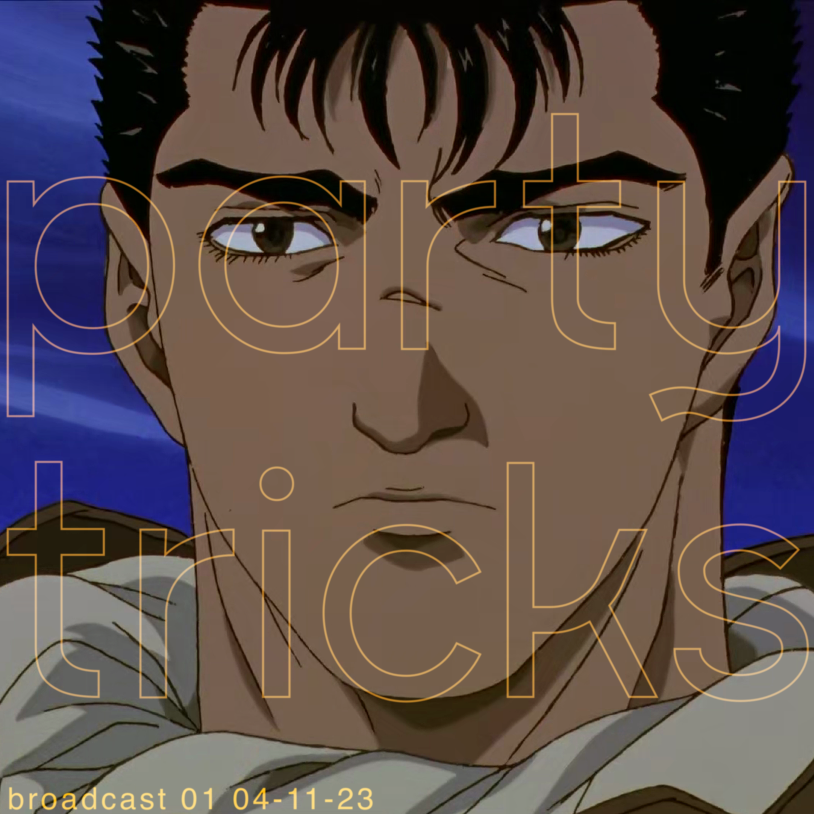

# Broadcast 01 - Slow Reverb Live Mix

## Info
Party tricks' first live mix, recorded live on 04-11-2023. 

A few months prior to this recording I was spending a lot of time listening to slowed/reverbed versions of songs on youtube.

It's interesting what simply changing a song's key and adding effects can yield -- the song sounds familiar but takes on new characteristics. Vocals morph, taking on new tones and attitudes, and percussion captures your train of thought in a totally different way. 

Nearly any moderately-known song you can think of has already been mixed in this way and uploaded to youtube. I found that I enjoyed the effect on pop songs the most.

This is a collection of some of the songs that I thought worked well, slowed and mixed live on index radio.

## Tracklist
1. Susuma Hirasawa - Gats
2. t.A.T.u. - Not Gonna Get Us
3. SOPHIE - NOTHING MORE TO SAY (DUB)
4. ECCO2K - Don't Ask
5. Gigi d'Agostino - L'Amour Toujours
6. Future - Turn On the Lights
7. Lady Gaga - Rain on Me
8. Future - Turn On the Lights
9. Black Marble - Iron Lung
10. Aphex Twin - Xtal
11. Omar S & Desire - 54321 (vocal mix)
12. XXYYXX - About You

## Downloads
- [59MB 192kbps MP3](https://partytricks.s3.amazonaws.com/01+Party+Tricks+Broadcast+01+-+low.mp3)
- [145MB 320kbps MP3](https://s3.console.aws.amazon.com/s3/object/partytricks?region=us-east-1&prefix=01+Party+Tricks+Broadcast+01.mp3)
