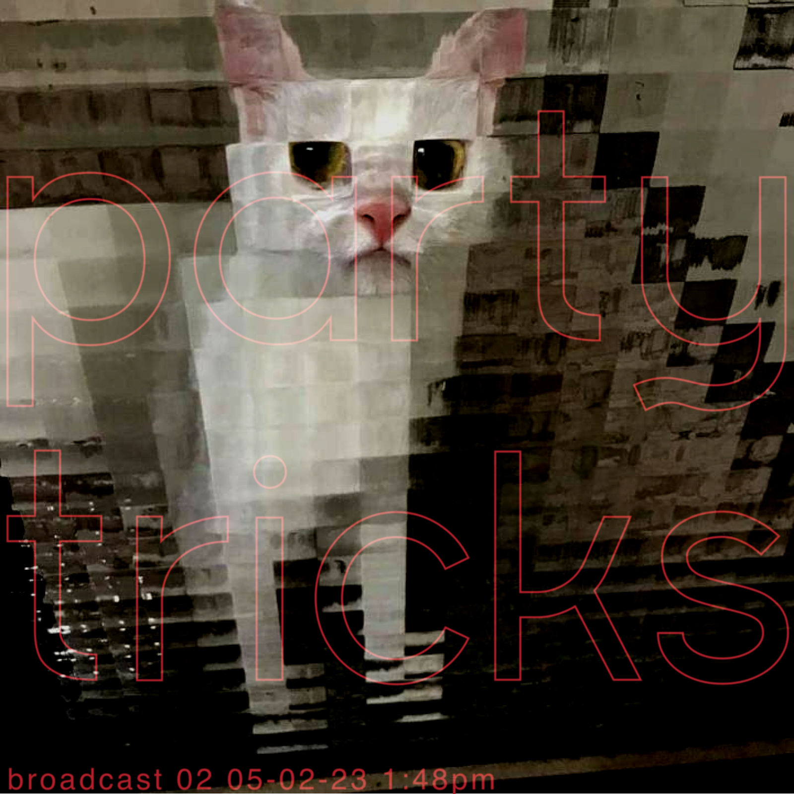

# Broadcast 02 - Darker Live Mix

## Info
Party tricks' second broadcast, recorded live on 05-02-2023. 

This one starts off with some psych-ish tracks and then moves into more dubby techno oriented stuff - all tracks I've been listening to lately. 

While I am definitely still learning to mix as made evident by a few of the transitions, I think this one turned out pretty well and I had a lot of fun recording it! Apologies for the recording quality, It's not too bad but I am still working out how to get the best sound from my setup.

## Tracklist
1. Banco de Gaia - Drippy
2. Link - Arcadian
3. Monolake - Reminiscence
4. Black Loops - Stoner Dreams
5. Blawan - No Rabbit No Life
6. nthng - Sub-Sonar
7. Pariter - Makam - Glacial Valley
8. Unknown Artist - BLD
9. Stephen Brown - Deep In (Len Faki Hardspace Mix)

## Downloads
- [88MB 192kbps MP3](https://partytricks.s3.amazonaws.com/02+Party+Tricks+Broadcast+02+-+low.mp3)
- [145MB 320kbps MP3](https://partytricks.s3.amazonaws.com/02+Party+Tricks+Broadcast+02.mp3)
